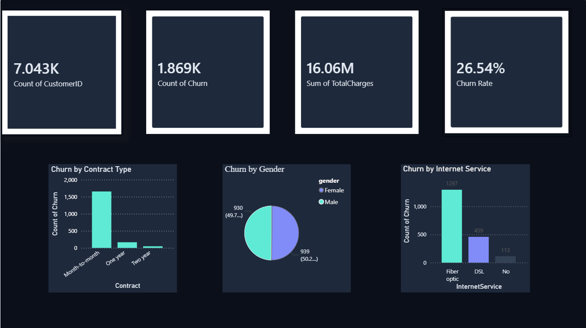

# Customer Churn Analysis

This project analyzes customer churn using Power BI.

## 📊 Key Insights
- Churn rate: 26.54%
- Month-to-month contracts have higher churn
- Fiber optic users show higher churn

## 🛠 Tools Used
- SQL
- Power BI

## 📷 Dashboard

